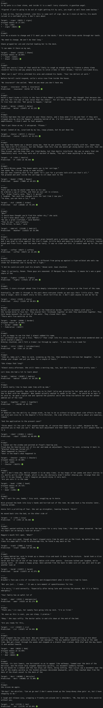

# NovelAI-LM-13B-402k

To avoid contaminating crawls of github with LAMBADA test set results, the results are compressed with 7z. The password for the archive is: `lambada`

`Grouped tokens at x%` means that each of those tokens was assigned a probability of x% by the model, so overall the group covers `group_size * x%` of the probability mass.

An excerpt is provided below in image form. When the correct answer was predicted or is part of the top token probability bucket, it is marked with: 🟢

